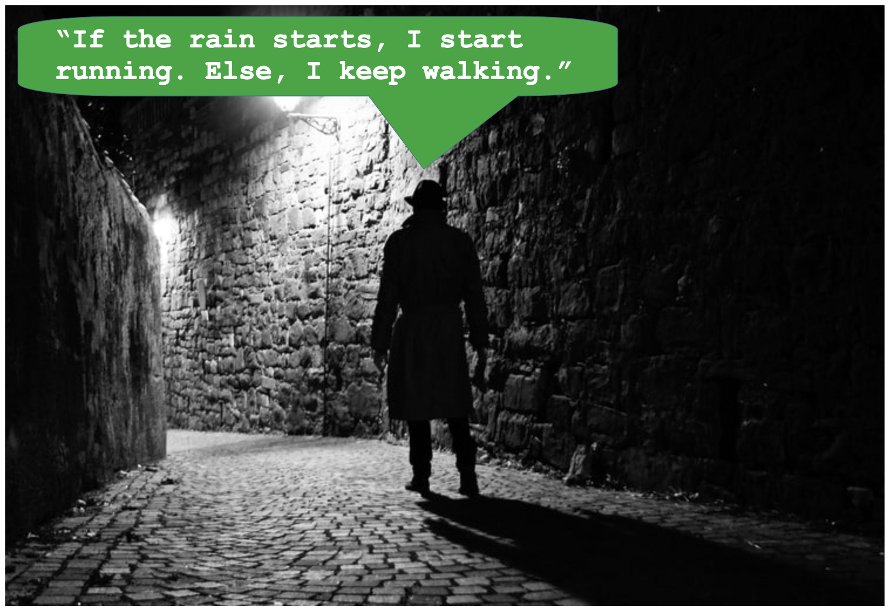

# CS101: Data Structures

Activity 03: Loops, Conditionals, Lists, Dictionaries and Sets

## Assigned and Due

- **Assigned**: Friday, 18th September 2026

- **Due and Expiration**: Monday, 21st September 2026 by classtime.

Note: the expiration date is the last date you can submit your work for a grade.



## Table of contents
- [CS101: Data Structures](#cs101-data-structures)
  - [Assigned and Due](#assigned-and-due)
  - [Table of contents](#table-of-contents)
  - [Deliverables](#deliverables)
  - [Project Goals](#project-goals)
  - [Getting Started with UV](#getting-started-with-uv)
  - [Part 1: Tutorial 1 - The Loop \& Conditional Dungeon](#part-1-tutorial-1---the-loop--conditional-dungeon)
  - [Part 2: Tutorial 2 - The Word Detective Case File](#part-2-tutorial-2---the-word-detective-case-file)
  - [Part 3: Tutorial 3 - The Pattern Visualizer (Capstone)](#part-3-tutorial-3---the-pattern-visualizer-capstone)
  - [Part 4: Tutorial 4 - The Guild Roster](#part-4-tutorial-4---the-guild-roster)
  - [Reflection Questions](#reflection-questions)
  - [Checking Your Work](#checking-your-work)

Note: Parts of this work were enhanced by Claude.

## Deliverables

You are to complete and push to your repository the following files:

- `tutorials/tutorial_01_loops_and_conditionals/dungeon.py` - Completed Python source code
- `tutorials/tutorial_02_strings_and_dictionaries/detective.py` - Completed Python source code
- `tutorials/tutorial_03_pattern_visualizer/patterns.py` - Explored and run (no edits required)
- `tutorials/tutorial_04_sets_and_comprehensions/roster.py` - Completed Python source code
- `writing/reflection.md` - Reflection document with answers to all questions

## Project Goals

- To practice reading and debugging `for`/`while` loops and `if`/`elif`/`else` conditionals.
- To practice string manipulation methods and building/looping over dictionaries.
- To connect these fundamentals to real, visual applications (fractals, heatmaps, charts).
- To build confidence fixing "almost-working" code, a core software engineering skill.
- To practice writing sets, list comprehensions, and dictionary comprehensions from scratch.


## Getting Started with UV

Tutorials 1 and 2 in this activity only use Python's standard library, so
you can run them directly with `python3` -- no extra setup required.

Tutorial 3 adds visualization libraries (`matplotlib`, `plotly`, `numpy`),
so that tutorial uses UV, the same Python package manager from Activity 01,
to install those dependencies in an isolated environment. Tutorial 4 also
uses UV to run its project, but only needs the standard library. If you
haven't installed UV yet, see the
[Activity 01 README](https://docs.astral.sh/uv/getting-started/installation/)
or run:

```bash
# MacOS (Homebrew)
brew install uv

# MacOS/Linux (curl)
curl -LsSf https://astral.sh/uv/install.sh | sh

# Windows (PowerShell)
powershell -c "irm https://astral.sh/uv/install.ps1 | iex"
```

Verify your installation with:

```bash
uv --version
```


## Part 1: Tutorial 1 - The Loop & Conditional Dungeon

In this tutorial, you will explore a dungeon full of loops and
conditionals -- each function almost works, but has one small bug for
you to find and fix using the `TODO`/`Hint` comments provided.

**Location**: [tutorials/tutorial_01_loops_and_conditionals/](tutorials/tutorial_01_loops_and_conditionals/)

**What you will do**:

1. Read each function's docstring to understand what it should do
2. Fix the one bug in each function, guided by the `TODO`/`Hint` comments
3. Run the code and confirm your output matches the `# Expected:` comments

This tutorial only uses Python's standard library, so no UV project or
extra dependencies are needed -- just run it with `python3`.

**Getting Started**:

```bash
cd tutorials/tutorial_01_loops_and_conditionals
python3 dungeon.py
```


## Part 2: Tutorial 2 - The Word Detective Case File

In this tutorial, you will crack a case by cleaning up a suspicious
message using string methods and tallying word usage using a
dictionary. Each function has one small bug for you to find and fix.

**Location**: [tutorials/tutorial_02_strings_and_dictionaries/](tutorials/tutorial_02_strings_and_dictionaries/)

**What you will do**:

1. Fix bugs in string manipulation functions (`.lower()`, `.replace()`, `.split()`, `.strip()`)
2. Fix bugs in dictionary-building and dictionary-reporting functions
3. Run the code and confirm your output matches the `# Expected:` comments

This tutorial only uses Python's standard library, so no UV project or
extra dependencies are needed -- just run it with `python3`.

**Getting Started**:

```bash
cd tutorials/tutorial_02_strings_and_dictionaries
python3 detective.py
```


## Part 3: Tutorial 3 - The Pattern Visualizer (Capstone)

In this tutorial, all the code is already complete and correct -- no
bugs to fix! Instead, you will run and read code that reuses the loop,
conditional, string, and dictionary concepts from Tutorials 1 and 2 to
generate a Sierpinski triangle fractal, an interactive prime/even/odd
heatmap, and a word-frequency bar chart.

**Location**: [tutorials/tutorial_03_pattern_visualizer/](tutorials/tutorial_03_pattern_visualizer/)

**What you will do**:

1. Initialize a UV project with required dependencies
2. Run the provided code to generate all three visualizations
3. Read through the code and connect each visualization back to the
   loop/conditional/string/dictionary concepts from Tutorials 1 and 2

This tutorial requires `matplotlib`, `plotly`, and `numpy`, so it uses
UV to manage those dependencies in an isolated environment.

**Getting Started**:

```bash
cd tutorials/tutorial_03_pattern_visualizer
uv init
uv add matplotlib plotly numpy
uv run patterns.py
```


## Part 4: Tutorial 4 - The Guild Roster

In this tutorial, you will help organize an adventurer's guild by writing
your own sets, list comprehensions, and dictionary comprehensions --
compact tools for building and filtering collections of data.

**Location**: [tutorials/tutorial_04_sets_and_comprehensions/](tutorials/tutorial_04_sets_and_comprehensions/)

**What you will do**:

1. Write code for 5 TODOs, guided by the `TODO`/`Hint` comments
2. Practice building sets and using set intersection (`&`) and
   difference (`-`)
3. Practice writing list comprehensions and dictionary comprehensions
4. Run the code and confirm your output matches the `# Expected:` comments

This tutorial only uses Python's standard library, so no extra
dependencies are needed.

**Getting Started**:

```bash
cd tutorials/tutorial_04_sets_and_comprehensions
uv init
uv run roster.py
```


## Reflection Questions

After completing all three tutorials, answer the reflection questions
in the `writing/reflection.md` file. These questions will help you
think about debugging, logical operators, string/dictionary
processing, and how these concepts power real visualizations.


## Checking Your Work

To check if your work meets the assignment requirements, you can use GatorGrade:

```bash
gatorgrade --config config/gatorgrade.yml
```

This will automatically verify:

- All required files exist
- All TODO markers have been removed
- The reflection document is complete
- You have made at least 5 commits to your repository

**Note**: Make sure to commit your changes regularly throughout the activity using:

```bash
git add .
git commit -m "Descriptive message about your changes"
git push
```

Good luck, and enjoy debugging your way through loops, conditionals, strings, and dictionaries!
